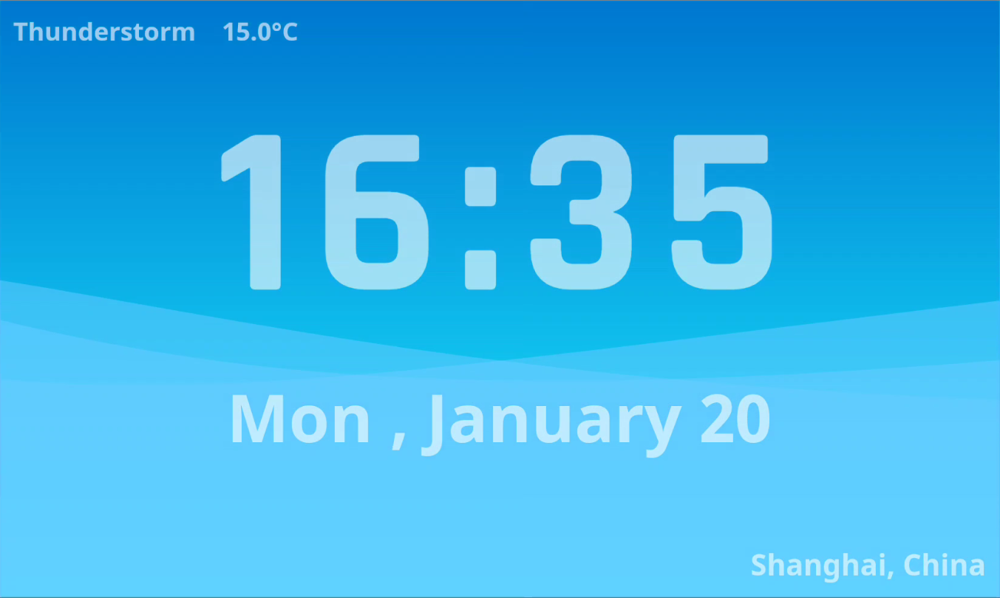
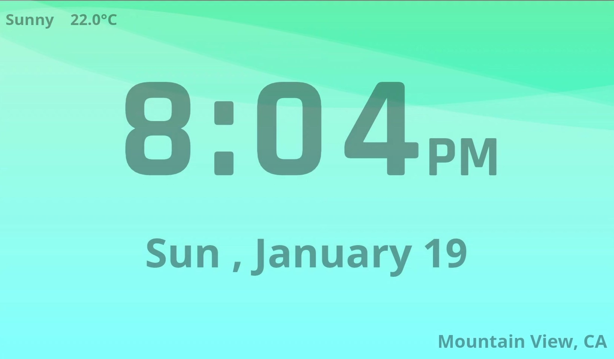
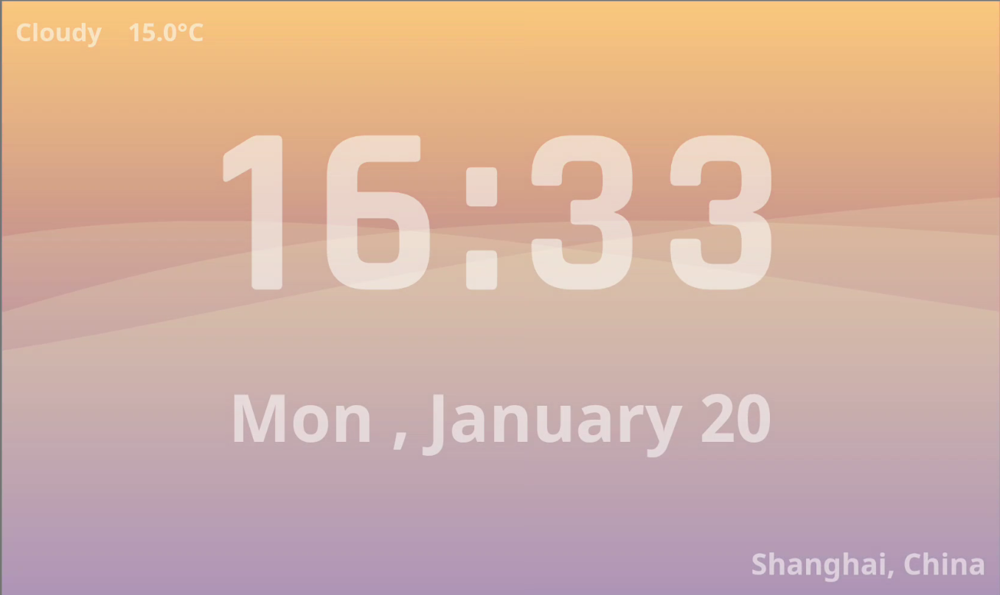
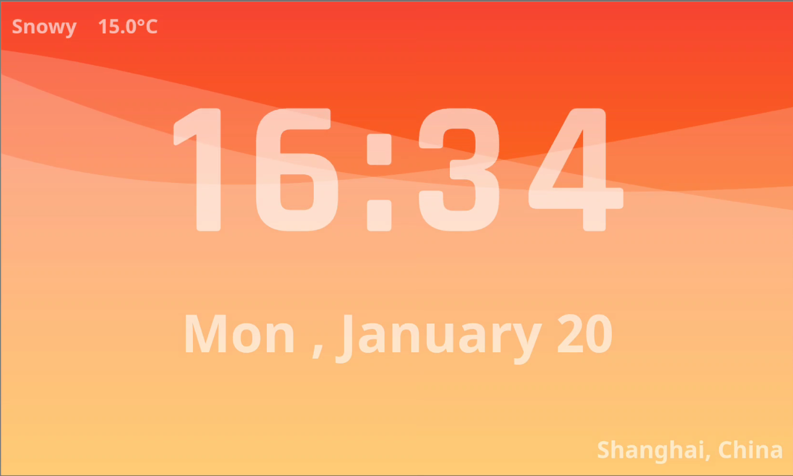
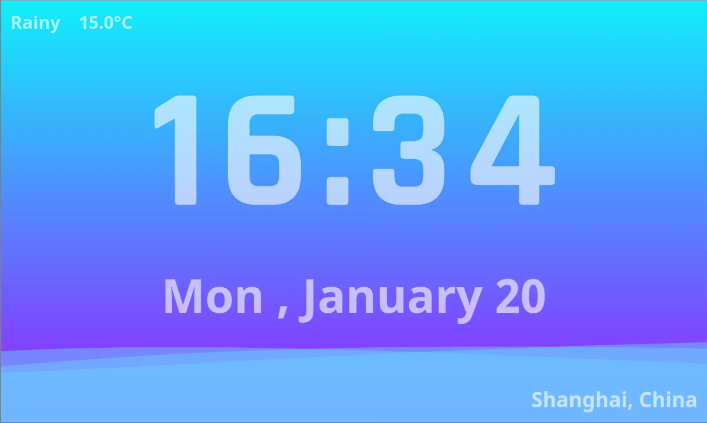
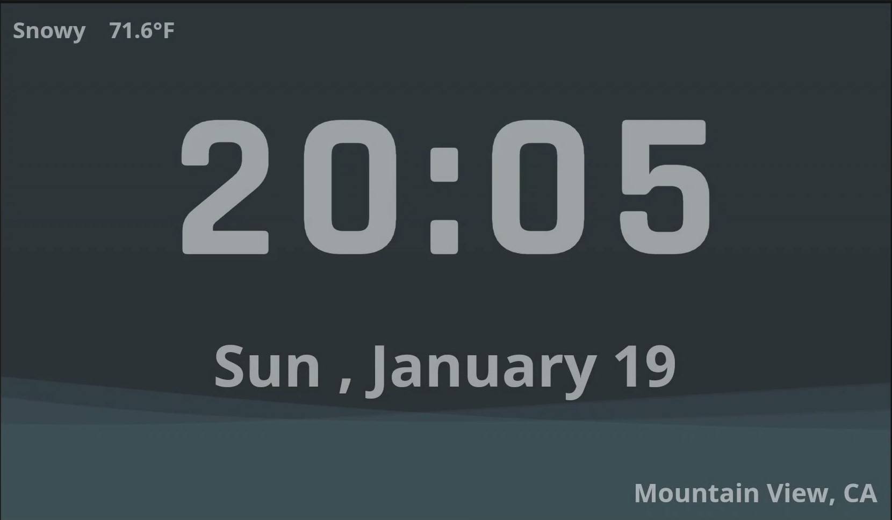

# Fluttering Clock

    

Welcome to Fluttering Clock !

## What is this ?

Fluttering Clock is a concise and elegant clock face written in [Flutter](https://flutter.dev/) for [Flutter Clock challenge](https://flutter.dev/clock).

## How to read time ?

As most clock faces do , Fluttering Clock shows current time and date in the middle of the screen , with animated color and [fluttering]('' "That's how the clock face got it's name") waves in the backgroud.

You can read `date` , `day of week` , `hour` and `minute` directly from the clock face . So what about `seconds` ? Check out the height of waves in the background ! The waves rise with current seconds , reach top of the screen at 59 seconds in a minute and fall to the bottom at the beginning of the next minute.

>So what is the exact seconds ?
>>I think you need a [vernier caliper]('' 'just kidding') .

## Features

* **Different themes depending on weather conditions**
  
  * Sunny

    

  * Cloudy

    

  * Snowy

    

  * Rainy

    

* **Dark Mode**

    

## Platforms
[Flutter](https://flutter.dev/) is designed to build applications for multiple platforms from a single codebase.

I've test the clock face on Android and Web , it should be ok on iOS too. See the web version of Fluttering Clock [here](http://fluttering-clock.firebaseapp.com/#/).